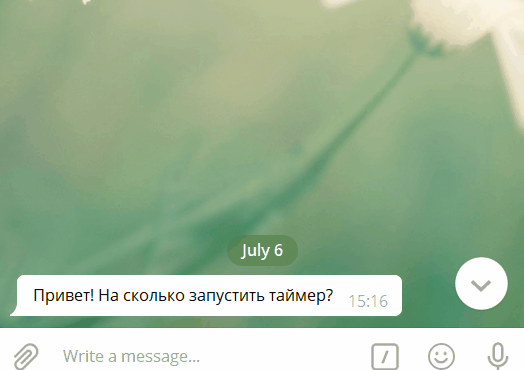

# Таймер-бот для Telegram
Данный скрипт запускает таймер на количество времени, указанное пользователем.
### Как установить
* Скачайте код
* Запустите команду `pip install -r requirements.txt` для получения актуальной версии библиотек
* Перейдите в Telegram, свяжитесь с `@test_timer2_bot` командой `/start`
* Запустите скрипт командой `python3 main.py`

### Пример диалога с ботом

### Цель проекта

Код написан в образовательных целях на онлайн-курсе для веб-разработчиков [dvmn.org](https://dvmn.org/).
